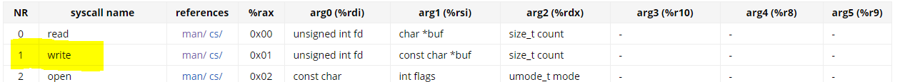
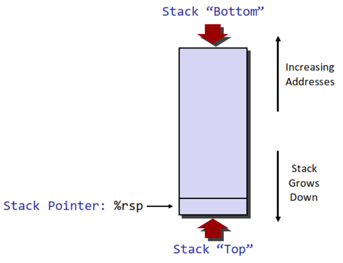

# 어셈블리어 배우기

## 1. hello.asm, strlen.asm 분석


```armasm
global    _start
section   .text        
_start:
    mov       rax, 1                ; write mode
    mov       rdi, 1                ; write to stdout
    mov       rsi, message          ; put message to write buffer
    mov       rdx, 13               ; print up to 13 letters
    syscall                         ; print
    mov       rax, 60               ; exit mode
    xor       rdi, rdi              ; set rdi to 0
    syscall
section   .data 
message:
    db        "Hello, World", 10    ; 10 is for new line(crlf)
```

`rax` 가 1일 때 `syscall` 이 걸리면 write이 실행되는 데 이때 `rdi`이 가르키는 파일에 (위에서는 stdout) `rsi`에 있는 값을 `rdx`만큼 print한다.



message 에서 10은 '\n'을 의미한다.

```armasm
BITS 6

section .text
global _start

strlen:
    mov rax, 0        ; use rax as count
.looplabel:
    cmp byte [rdi], 0 ; if character at rdi(index) is 0(null)
    je  .end          ; jump to end
    inc rdi           ; increse index
    inc rax           ; increase count
    jmp .looplabel    ; restart the loop
.end:
    ret               ; finish the loop (returns to where it called)

_start:
    mov   rdi, msg    ; msg to rdi
    call  strlen      ; calls strlen
    add   al, '0'     ; lower 1 byte of rax(count).
    mov  [len], al    ; 
    mov   rax, 1      ; write mode
    mov   rdi, 1      ; writes on stdout
    mov   rsi, len    ; move len to print buffer
    mov   rdx, 2      ; print length 2
    syscall           ; print
    mov   rax, 60     ; exit mode
    mov   rdi, 0      ; sets it 0 to return 0
    syscall           ; exit

section .data
    msg db "hello",0xA,0  ; "hello\n\0"
    len db 0,0xA          ; "\0\n"
```

`strlen` 또한 instruction set description을 읽어가면서 천천히 해석하면 크게 어려움이 없이 이해할 수 있다.

`je` 는 현재 `EFLAGS` 중 `ZF` 가 0 인지 확인하는데 그 바로 위의 `cmp` instruction 에서 ZF를 연산에 따라 0 혹은 1로 세팅한다. 

## 2. hello.asm upgrade하기

```armasm
global    _start
section   .text        
_start:
    mov       rax, 1                ; write mode
    mov       rdi, 1                ; write to stdout
    mov       rsi, message          ; put message to write buffer
    mov       rdx, 36               ; print up to 36 letters
    syscall                         ; print
    mov       rax, 60               ; exit mode
    xor       rdi, rdi              ; set rdi to 0
    syscall
section   .data 
message:
    db        "Hello, World", 10, "My name is Jeongyoung" 10, 0 
```

1번의 hello.asm 과 다른점은 message 의 string을 바꾸고 이의 사이즈에 맞게 rdx를 늘려준 것이다. 또한 string 의 마지막에 null character가 없는 것이 뭔가 이상해서 넣어줬다.

## 3. hello.asm upupgrade 하기 

```armasm
global    _start
section   .text

_strlen:                        ; retruns length of rdi up to null char to rax
    mov       rax, 0            ; it's same as strlen.asm above

.looplabel:
    cmp       byte [rdi], 0
    je        .end
    inc       rdi
    inc       rax
    jmp      .looplabel
.end:
    ret

_start:
                                ; calculate length of format
    mov       rdi, format       ; calculate the length of the format

    call      _strlen

    mov       rdx, rax          ; rde == length of the format
    mov       rsi, format       ; put "format" in rsi buffer
    mov       rax, 1            ; write mode
    mov       rdi, 1            ; write to stdout
    syscall

                                ; use argument and print
    pop       rsi               ; argc
    pop       rsi               ; argv[0]
    pop       rsi               ; argv[1]

    mov       rdi, rsi          ; set argv[1] to be strlen's argument

    call      _strlen

    mov       rdx, rax          ; set length of the string to rdx
    mov       rax, 1            ; write mode
    mov       rdi, 1            ; write to stdout
    syscall

                                ; prints "\n"
    mov       rax, 1            ; write mode
    mov       rsi, newline      ; put newline in buffer
    mov       rdi, 1            ; write to stdout
    mov       rdx, 2            ; length of the "\n\0" is 2
    syscall

    mov       rax, 60           ; exit mode
    xor       rdi, rdi          ; sets rdi to 0 (to return 0)
    syscall                     ; exit

section .data
    format     db  "Hello, World", 10 ,"My name is ", 0
    newline    db  10, 0            ; new line
```
---

위의 코드를 아래와 같이 compile하면 결과가 다음과 같이 나온다.

---
 
```sh
nasm -felf64 hello_upgrade.asm
ld -s hello_upgrade.o -o hello_upgrade
```


원리는 다음과 같다. 주어진 문제를 다음과 같이 3개의 step으로 나눠서 풀 수 있을 것이다.

**1. parameter에서 값을 받는다**

**2. 값의 length를 찾는다.**

**3. 주어진 값들로 print를 한다.**


첫번째로, parameter에서 값을 받기 위해서는 x86_64를 조금 알아야 한다. 우리가 `c` 에서 값을 받을 때 다음과 같이 값을 받지 않던가

```c
#include <stdio.h>

int main(int argc, char** argv){
    printf("%s\n", argv[1]);
    return 0;
}
```
### 1. commandline에서 값 받기

여기서 `argv[0]` 부터 실행파일 이름, 그리고 그 외의 input 파라미터가 들어갔다. 이처럼, 내가 이해하기로는 `./hello_upgrade isaac` 와 같이 실행을 하면 OS가 알아서
rsp부터 + 8을하며 `argv[i]` 의 값을 집어 넣는다. 




우리는 이를 `pop` 이라는 명령어를 사용해 꺼내쓰면 된다.

`pop`은 자동으로 `rsp`의 데이터를 회수하여 `dest`에 값을 저장하고 `rsp`를 증가시킨다. 얼마나 친절한가!

### 2. commandline에서 값으로 받은 값의 길이 찾기

strlen함수는 주어진 것을 사용하면 된다. 어차피 string에 끝에 `'\0'`가 있기 때문에 그냥 잘 활용만 하면 된다.


### 3. print 하기

이 스텝은 1번과 매우 유사하기 때문에 문제 1과 2번을 이해를 하면 충분히 구현 할 수 있다고 생각된다. 


### More...
코드가 원하는 대로 작동을 하지만 마음에 썩 들지는 않는다...꽤나 코드가 더럽다. 원하는 출력을 위해 필요한 문법을 위주로 공부 하다보니 조금 더 효율적이고 예쁘게 코딩할 수 있는 방법은 시간관계상 찾아볼 수 없었다.

예를 들어, 위 코드에서는 write syscall을 3번 하는데 이를 한번으로 줄일 수 잇는 방법이 있을 것이다. Strng 하나로 만들어서 syscall 한번만 하면 되기 때문이다. 


## 참조

명령어 set 
- https://modoocode.com/en/inst/jcc
- https://chromium.googlesource.com/chromiumos/docs/+/master/constants/syscalls.md#x86_64-64_bit
x86_64 구조
- https://gist.github.com/Gydo194/730c1775f1e05fdca6e9b0c175636f5b
- https://it-eldorado.tistory.com/37
