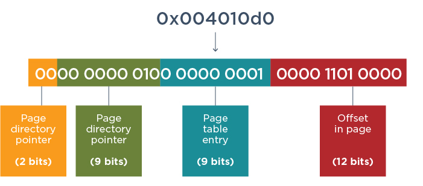
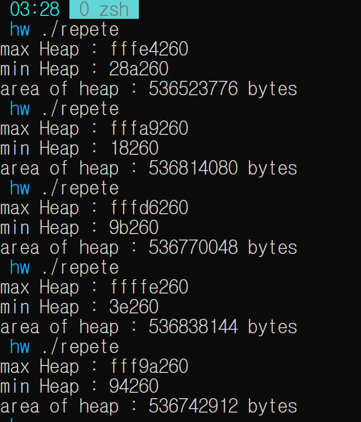

# ASLR 과 Heap Size

처음에는 ASLR에 대하여 찾아보려고 했다.

## ASLR : Address Space Layout Randomization
>ASLR은 가상주소공간에 어떤 object가 매핑될 때 그 위치를 프로그램 실행시마다 랜덤하게 변경하는 보안 기법이다.


하지만 프로그램을 실제로 돌렸을 때 주소값이 바뀌기는 하지만 고정적인 비트도 있었다. 그래서 궁금했다. 

>그렇다면 ASLR은 얼마나 random 한 것일까?



찾아보니까 32-bit application은 다음과 같이 bit를 활용한다고 한다. 0 ~ 11 bit는 offset이라서 random 하게 바뀌면 안되고, 또 31, 30 은 각각 kernel과 PAE 용으로 쓰인다고 한다. 실질적으로 randomize 되는 bit의 수는 32 - 14 = 18bit 이고 address가 randomize 됬을 때의 경우의 수는 2^18 = 262144 로 생각보다 적다. 게다가 windows는 실질적으로 8bit만 randomize 하기 때문에 2^8 = 256 가지의 경우의 수 밖에 없다. windows 에서는 64bit program 또한 17 ~ 19 bit만 randomize 하기 때문에 131072 ~ 524288 정도의 경우의 수로 그렇게 큰 편이 아니라고 생각이 든다.

그 다음에 생각한 것은 그래서 ASLR이 정말로 무작위 한지를 확인하려고 했다. 경우의 수가 적으니 이것이 가능할 것이라 생각했다. 여러번 실행을 하고 address의 분포도를 확인하면 address 가 정말로 균등하게 분포되었는지 확인하고 싶었기 때문이다. 

>무작위(無作爲, randomness, 랜덤너스), 임의(任意), 무선(無選)은 사건에 패턴이나 예측 가능성이 없는 것을 말한다.[1] 즉, 인위적인 요소가 없는 것, 규칙성이 없는 것을 의미한다. 일반적으로 주사위의 눈처럼 각 항목이 나타나는 확률이 같은 상태를 의미하며, 로또 추첨도 이와 비슷한 개념으로 적용된다. 그래서 랜덤(Random)이라고 한다.

하지만 구현을 할 때 여러가지 문제로 실질적인 구현은 하지 못 했다. 그래서 내가 이것 말고 실질적으로 구현 할 수 있는 것이 어떤 것이 있을까 생각해봤다.

## Heap Size 구하기

그래서 생각한 것이 다음이다.
 
>프로세스를 여러번 실행시키면서 address의 min 과 max의 위치를 찾으면 heap Size를 구할 수 있지 않을까?

코드는 다음과 짜보았다.

```c
#include <stdio.h>
#include <stdlib.h>

#define FILENAME "address.txt"

const long TRIALS = 10000;

int main(){
    char cmd[128] = "./exploitASLR > address.txt " ;
    unsigned long address;
    unsigned long max = 0x00000000;
    unsigned long min = 0xffffffff;
    FILE *fp;

    for(int i = 0; i < TRIALS; i++){
        system(cmd);
        fp = fopen(FILENAME,"r");
        fscanf(fp, "%lx", &address);
        if(address > max)
            max = address;
        if(address < min)
            min = address;
    }

    printf("max Heap : %x \nmin Heap : %x\n", max, min);
    printf("area of heap : %d bytes\n", (max - min) / 8);

    return 0;
}

```

./exploitASLR은 간단히 malloc을 하여 heap 메모리 지정을 해주고 지정된 메모리의 주소를 출력하고 free한다.

이를 여러번 반복시킨 것이 위의 코드이다.

```c
#include <stdio.h>
#include <stdlib.h>
#include <unistd.h>


int main(){
    char* heap = NULL;

    heap = (char*)malloc(1024);

    printf("%x\n", heap);

    free(heap);

    return 0;
}

```

이를 반복시키면 다음과 같은 결과가 나온다. allocation을 10000을 반복시킨걸 여러번 실행해보았다. 그러니 의미있는 결과가 나온다.



## 결론

대강 max 는 0xfffxxxxx 근처일 것이고 min은 정말 낮게도 갈 수 있어 보인다. 여기서 area of heap은 (max - min) / 8 로 구했는데 이것을 여러번 실행해도 heap size는 536 MB로 비슷한 결과를 낸다. 이것이 실제 heap의 사이즈인 것 같아 보이지는 않는다. 인터넷에 heap size를 검색해보니 java 가 2~8 GB heap size가 있다고 하기 때문이다. 이 결과에서 확인 할 수 있는 것은 그저 `ASLR은 주소를 정말로 compeletely 무작위하게 주지 않는다 라는 것`이다.이번 과제를 하며 ASLR이 어떤 방식으로 작동하는지 정확히 알고자 하였으나 대략적인 느낌만 얻게되서 아쉬운데 7일차 쯤에 ASLR이 포함 되어 있으니 그때 좀 더 알아보고자 한다.  

## 참조
https://engineering.mit.edu/engage/ask-an-engineer/can-a-computer-generate-a-truly-random-number/

https://bpsecblog.wordpress.com/2016/05/16/memory_protect_linux_1/

http://choesin.com/aslr%EC%9D%B4%EB%9E%80-%EB%AC%B4%EC%97%87%EC%9D%B4%EB%A9%B0-%EC%96%B4%EB%96%BB%EA%B2%8C-%EC%BB%B4%ED%93%A8%ED%84%B0%EB%A5%BC-%EC%95%88%EC%A0%84%ED%95%98%EA%B2%8C-%EC%9C%A0%EC%A7%80%ED%95%A9%EB%8B%88

https://www.fireeye.com/blog/threat-research/2020/03/six-facts-about-address-space-layout-randomization-on-windows.html