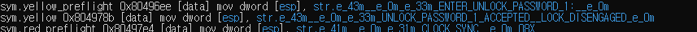
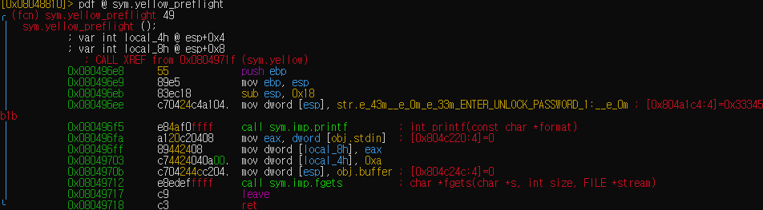
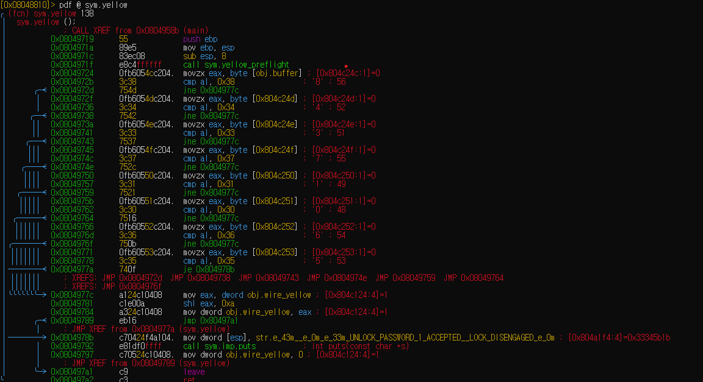
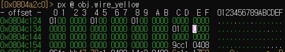
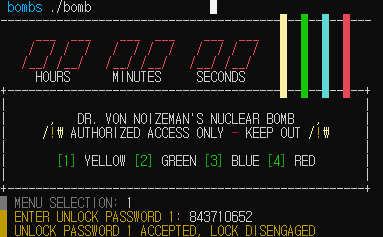
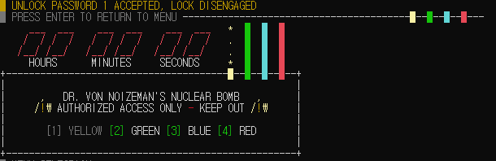

# bomb 노란색 선 제거하기

나는 `radare2`를 사용하여 `bomb`의 노란색 선을 제거해보았다. 

`radare2`에서 `iz` 명령어를 치면 data section에 있는 string들이 나온다.


... 여러가지 string 이 나오지만 우리가 주목해야할 부분은 다음이다.


`Enter UNLOCK PASSWORD` 부분 근처에 값을 받는 내용이 있을 것이고, `UNLOCK PASSWORD 1 ACCEPTED` 가 우리가 원하는 부분이기 떄문이다.

`axt @@ str.*` 라는 명령어를 입력하면  다음 string을 참조하는 코드들을 찾아준다.


`axt @@ str.*` 의 결과는 다음과 같다. 



그 중 우리는 `Enter UNLOCK PASSWORD`와 `UNLOCK PASSWORD 1 ACCEPTED`를 집중해서 봐야하니 `sym.yellow_preflight` 와 `sym.yellow`를 살펴보자



`sym.yellow_preflight`는 대강봐도 일단 `ENTER_UNLOCK_PASSWORD_1 :`을 출력하고 `fgets`를 사용해 `obj.buffer`에 값을 받는 것을 확인할 수 있었다.



`sym.yellow`는 뭔가를 잔뜩 비교한다. 이때 비교하는 부분을 잘 보면 `byte[obj.buffer]의 값 + a` 의 값과 어떠한 수와 비교하는 것을 볼 수 있었다. 만약 같지 않다면 전부 쭉 내려가

```armasm
...
mov eax, dword obj.wire_yellow
shl eax, 0xa
mov dword obj.wire_yellow, eax
...
```
를 실행 시키는데, 결과적으로 obj.wire_yellow 내의 값을 10번 shift left 시켜준다. 0이 아닌 값을 넣어주지 않고 이렇게 하는 이유는 기존의 있는 값이 0이면 유지하고 아니라면  그 값을 다른 값으로 출력시켜주기 위해서 인듯 하다.

<details>
<summary><b>obj.wire_yellow 에 더 알아보기</b></summary>
<div markdown="1">

`obj.wire_yellow`가 1이라고 나오지만 진짜 1인지 궁금해서 obj.wire_yellow를 처음으로 값을 
주는 부분을 찾고자 했다. 이는 `px` 명령어로 확인할 수 있었다. 



보다 싶히 `dword[obj.wire_yellow]` 는 `0100 0000 0100 0000 0100 0000 0000 0000` 이런식으로 값이 지정되있었다. 왜 굳이 이렇게 했을까? `0000 ... 0001`로 채워나도 되는 것 아닌가? 


</div>
</details>

다른 분기는 `UNLOCK PASSWORD 1 ACCEPTED`를 print 하고`obj.wire_yellow`에 0을 넣는 것을 확인 할 수 있다 

```armasm
...
call sym.imp.puts
mov dword obj.wire_yellow, 0
...
```
이 `obj.wire_yellow` 값이 0일 때 우리가 원하는 값이 나오는 것을 확인 하기 위해 `sym.menu` 를 확인해 보았다.


다음과 같이 `sym.menu` 는 0과 `obj.wire_yellow` 와 비교하기 때문에 이와 달리 가는 분기가 맞을 것이라는 추측을 할 수 있었다.



**답은 `84371065*`**(*는 정규표현식의 *) 이다



## 참조

- https://www.megabeets.net/a-journey-into-radare-2-part-1/#Mark
- https://fir3.tistory.com/22