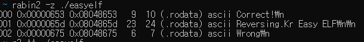
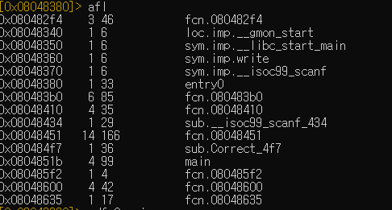
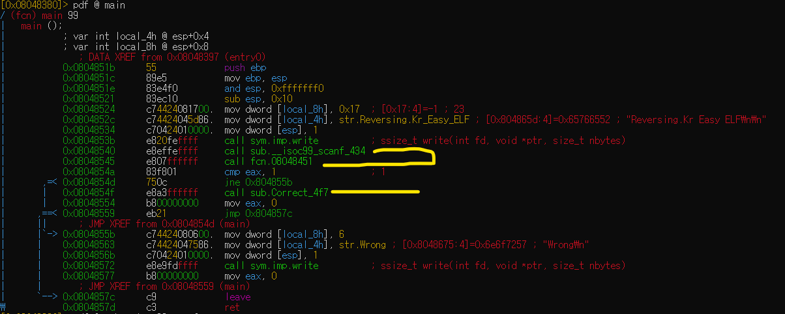
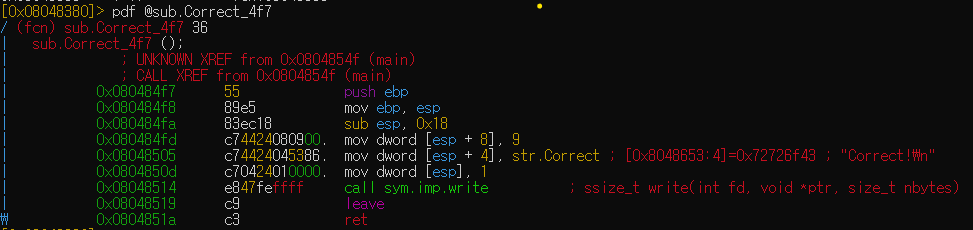
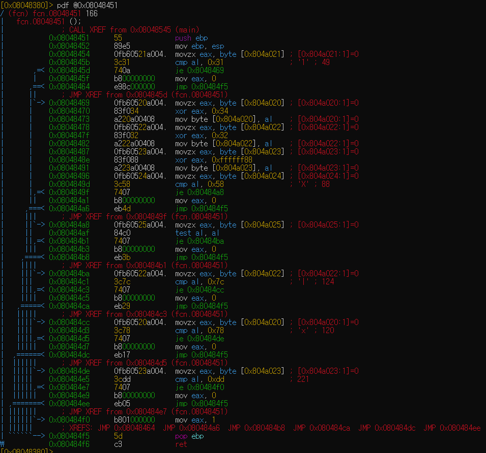
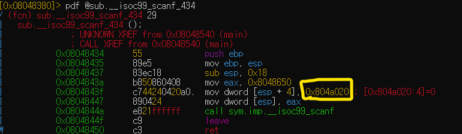
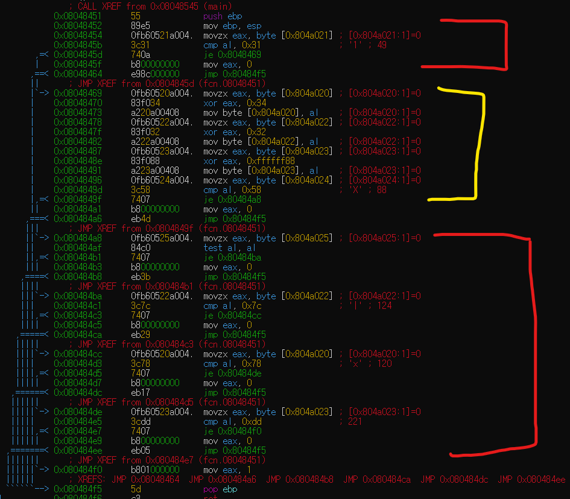

# easyelf 풀이

**첫째로, 어떠한 문장을 print 하는지 확인해 보았다.**

 

**우리가 원하는 것은 저 `Correct`를 print 시키는것.**

**나는 `radare2`로 분석./을 했는데, 첫번째로, 프로그램내의 함수들을 확인해 보았다.**



**`main` 이 있다 `main` 으로 가보자**



**차분히 보니 `wrong`만 있고 우리가 원하는 `Correct`는 보이지 않는다. `Wrong` 으로 가는 분기를 살펴보면 eax가 1일때 `wrong`으로, 0일때 `sub.Correct_467`을 실행시키는 것을 확인. `sub.Correct_467`로 가보자.** 



**역시나 `sub.Correct_467`를 print하는 함수다. 이외에 중요한 것은 없어보이니 다시 `main` 으로 가서 `eax`를 1으로 만드는 로직을 살펴보자. 이전에 보았던 분기를 보면**

```armasm
call fcn.08048451
cmp eax, 1
jne 0x0804855b
```

**cmp를 하기전에 `fcn.08048451`을 부른다. 자연적으로 이 함수가 eax를 변화시키지 않을까 싶어 들어가봤다.**



**역시나, `eax`를 조작하는 분기들이 보인다. 줄이 길어 어려어보이나 특정한 패턴이 있다는 것을 발견했다.**

```armasm
movz eax, byte[0x804a025]
cmp al, 0x7c
je 0x80484cc
mov eax, 0
jmp 0x80484f5
```

**다음은 `0x080484a8` 부분을 가져온 것이다. 첫번째로 어떠한 주소(`0x804a025`)에서부터 byte단위로 값을 `eax`로 옮기고 그 값을 `0x7c`와 비교한다. 만약 같다면 그 바로 밑으로 아니라면 `eax`에 0을 넣고 밑으로 가서 함수를 끝내는 protocol이 존재한다.**


**그렇다면 `0x804a025` 부분이 우리가 password 로 넣는 주소가 맞는지 확인하고 싶어서 scanf 함수를 찾아 들어가봤다.**



**역시나 우리가 password로 주는 값을 `0x804a020` 에 넣어주는 것을 확인할 수 있었다. 이제 password를 해독 하기만 하면 된다.**



**`fcn.08048451`를 두 섹션으로 나눠서 해석을 하였다. 섹션안에 비슷한 행동을 하기 때문이다. 일단 빨간색으로 칠해진 부분은 위에서 설명했다싶히 어떠한 값과 비교하는 것이다. 이는 간단한데 그 전에 노란색으로 표시된 부분이 실행되기 때문에 이를 이해할 필요가 있다. 다음은 노란색의 한 부분을 가져온 것이다.**

```armasm
movzx  eax, byte [0x804a020]
xor eax, 0x34
mov byte [0x804a020], al
```

**`0x804a020`에서 byte 단위로 가져와 `xor`연산을 하고 원래 있던 자리에 다시 넣어준다. 노란색 섹션의 나머지도 다음과 같은 일을 한다. 이를 `decoding`하기 위해서는 다음과 같은 표가 필요하다.**


|주소|원본(input)|xor|결과|
|---|----|---|---|
|0x804a020| |0x34|0x78|
|0x804a021| ||1|
|0x804a022| |0x32|0x7c|
|0x804a023| |0xffffff88|0xdd|
|0x804a024| ||0x58('X')|
|0x804a025| ||0|

**`xor` 로 암호화 된 암호문을 decript 하려면 `key` 로 사용 된 `xor` 연산을 다시 하면 된다. 예로**

`plainText xor 0x34 = 0x78`

 `0x78 xor 0x34 = platinText`

**위를 사용해서 결과를 종합하면, 다음이 나오는 것을 확인 할 수 있다.**

|주소|결과|xor|원본|
|---|----|---|---|
|0x804a020|0x78|0x34|0x4C('L')|
|0x804a021|1||1|
|0x804a022|0x7c|0x32|0X4E('N')|
|0x804a023|0xdd|0xffffff88|0X55('U')| 
|0x804a024|0x58||0x58('X')|
|0x804a025|0||0('\0')|

>참고로 `0x804a023`부분은 어차피 byte단위로 잘라 연산하기때문에 `xor 0x88` 하는 것과 같다.`0x804a025`부분은 NULL 이다. 

# 답은 `L1NUX` 이다