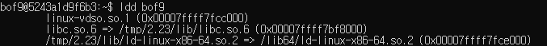

# bof9

`bof9.c` 은 다음과 같다.


프로그램에서는 `gets_s` 대신 `gets`를 써 `buffer overflow`취약점이 있다.


`NX(Never eXecute) bit` 가 걸려있는 이 파일을 우회하기 위하여 `RTL(Return to Libc)`방법을 쓰자. 그 중에서도 `ROP(Return Oriented Programming)`으로 우리가 원하는 대로 프로그램을 프로그래밍 할 수 있다.

스택은 본래 `original` 과 같은 구조를 가지지만 우리는 `Hacked`의 주소구조를 가지게 `buf`에 값을 채워주면 된다. 그렇다면 프로그램을 끝내려고 `return adress`로 돌아가는 순간 `pop rdi, ret`을 실행시키고 `system`이 `bin/sh` 을 인자로 가지며 실행이 된다.

|Origianl 스택 구조| Hacked 스택 구조|
|--|---|
|main stack 끝부분 + 8 |system 함수의 주소|
|main stack 끝부분 |/bin/sh 문자열의 주소|
|return address가 담긴 곳|`pop rdi, ret`가 담긴 libc의 주소|
|vuln stack 시작부분|쓰레기값|
|buf|쓰레기값|

이제 이걸 하려면 다음을 알아야한다.
1. `system`함수의 주소,
1. `"/bin/sh"` 문자열의 주소
1. `pop rdi, ret`가 담긴 libc의 주소
1. buf에서 return address까지의 거리

하나하나 해보자.

친절하게도  프로그램에서 `system`과 `/bin/sh` 문자열의 주소를 가르켜 준다.


주어지지 않는다면 다음과 같이 하나하나 찾아서 진행해야 할 것이다.


여기에 있는 문자열을 `8byte`형식으로 꽉채워줘서 넣어주면 된다. 일단 1과 2는 준비가 됬고 3번은 다음과 같은 방식으로 얻는다. 일단 `bof9`에서 사용하는 `libc`를 찾는다.



`ldd command`를 사용하면 프로그램이 필요로 하는 공유라이브러리 목록을 출력한다.
이 중 2번째 `/tmp/2.23/lib/libc.so.6`에서  `pop rdi, ret`를 찾아보자


<span style="color:yellow;background:black"> 노란색</span> 으로 highlight 부분을 보면 우리가 원하는 명령어가 `libc.so.6`의 `21102` 만큼의 offset에 위치하고 있는 것을 확인 할 수 있다. 그렇다면 우리가 `libc.so.6`의 주소를 안다면 다음과 같이 `pop rdi, ret`의 정확한 위치를 알아낼 수 있다.


`gdb` 에서 `vmmap` 를 사용하면 메모리 구조를 확인할 수 있다. 여기다가 `offset`을 더해보자.


이제 남은 것이 뭔지 보자.

1. ~~system 함수의 주소,~~
1. ~~/bin/sh 문자열의 주소~~
1. ~~`pop rdi, ret`가 담긴 libc의 주소~~
1. buf에서 return address까지의 거리

이제 `retrun address` 까지의 거리를 알아내면 된다. 이는 이전(이전 bof문제들...)에 하는 것과 같은 방법으로 알아내면 되는데 이는 `16`이다.


이제 페이로드를 작성하면 된다.
stack 밑에서부터 `little endian` 형식으로 다음과 같이 작성하면 된다.(8byte 형식에 맞쳐서 0을 채워준다.)

```bash
(python -c "print 'x'*16+'\x02\xe1\xa2\xf7\xff\x7f\x00\x00'+'\x57\x9d\xb9\xf7\xff\x7f\x00\x00'+'\x90\x23\xa5\xf7\xff\x7f\x00\x00'";cat) | ./bof9
```

성공~!


